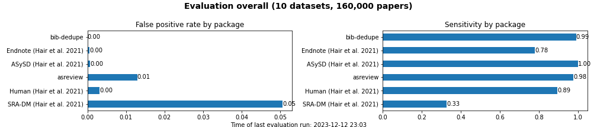

# bib-dedupe

<!-- [](https://github.com/CoLRev-Environment/bib-dedupe/releases/) -->
[](https://github.com/pre-commit/pre-commit)

## Overview

Bib-Dedupe is an open-source **Python library for deduplication of bibliographic records**, tailored for literature reviews.
Unlike traditional deduplication methods, Bib-Dedupe focuses on entity resolution, linking duplicate records instead of simply deleting them.
This approach enables validation, undo operations, and a more nuanced understanding of record relationships.

## Features

- Goal: automated duplicate linking without false positives
- preprocessing approach that mirrors the specific error generation process of academic databases (e.g., re-formatting authors, abbreviating journals)
- **Entity Resolution**: Bib-Dedupe does not simply delete duplicates, but it links duplicates to resolve the entitity and integrates the data. This allows for validation, undo operations, and a more comprehensive understanding of record relationships.
- **Programmatic Access**: Bib-Dedupe is designed for seamless integration into existing research workflows, providing programmatic access for easy incorporation into scripts and applications.
- **Transparent and Reproducible Rules**: Bib-Dedupe's blocking and matching rules are transparent and easily reproducible. Researchers can fine-tune these rules based on their specific needs, promoting reproducibility in deduplication processes.
- **Continuous Benchmarking**: Continuous integration tests running on GitHub Actions ensure ongoing benchmarking, maintaining the library's reliability and performance across datasets.
- **Efficient and Parallel Computation**: Bib-Dedupe implements computations efficiently and in parallel, using appropriate data structures and functions for optimal performance.

## Installation

To install Bib-Dedupe, use the following pip command:

```bash
pip install bib-dedupe
```

## Getting Started

```python
import pandas as pd
from bib_dedupe.bib_dedupe import merge

# Load your bibliographic dataset into a pandas DataFrame
records_df = pd.read_csv("records.csv")

# Get the merged_df
merged_df = merge(records_df)
```

For more detailed usage instructions and customization options, refer to the documentation.

For advanced use cases, it is also possible to complete and customize each step individually

```python
from bib_dedupe.bib_dedupe import prep, block, match, merge, export_maybe, import_maybe

# Block records
blocked_df = block(records_df)

# Identify matches
matched_df = match(blocked_df)

# Check maybe cases
export_maybe(matched_df, records_df, matches)
matches = import_maybe(matches)

# Merge
merged_df = merge(records_df, matches=matches)
```

Fields used by BibDeduper

| **Name**        | **Definition**                                               |
|-----------------|--------------------------------------------------------------|
| **ID**          | A unique ID                                                  |
| **author**      | The author(s) of the publication                             |
| **title**       | The title of the publication                                 |
| **year**        | The year of publication                                      |
| **journal**     | The name of the journal in which the publication appeared    |
| **volume**      | The volume number of the publication                         |
| **number**      | The issue number of the publication                          |
| **pages**       | The page numbers of the publication                          |
| **doi**         | The Digital Object Identifier (DOI)                          |
| **abstract**    | The abstract                                                 |
| **search_set**  | Distinct sets of papers (e.g., old_search), can be empty.    |

## Continuous evaluation

Bib-dedupe is continuously evaluated against other Python libraries (currently the [asreview datatools](https://github.com/asreview/asreview-datatools)) for duplicate removal in bibliographic datasets.
Complementary data from Hair et al. (2021) is added to the overview.
The notebooks are available for the [evaluation](notebooks/evaluation.ipynb), and the datasets are available in the [data](data) section.
A summary of the evaluation is available in the [README.md](notebooks/README.md), aggregated summaries are exported to [current_results.md](output/current_results.md), and detailed results are exported to a [csv file](output/evaluation.csv).



## Documentation

Explore the official documentation for comprehensive information on installation, usage, and customization of Bib-Dedupe.

## Citation

If you use Bib-Dedupe in your research, please cite it as follows:

TODO

## Contribution Guidelines

We welcome contributions from the community to enhance and expand Bib-Dedupe. If you would like to contribute, please follow our contribution guidelines.

## License

Bib-Dedupe is released under the MIT License, allowing free and open use and modification.

## Contact

For any questions, issues, or feedback, please open an issue on our GitHub repository.

Happy deduplicating with Bib-Dedupe!
