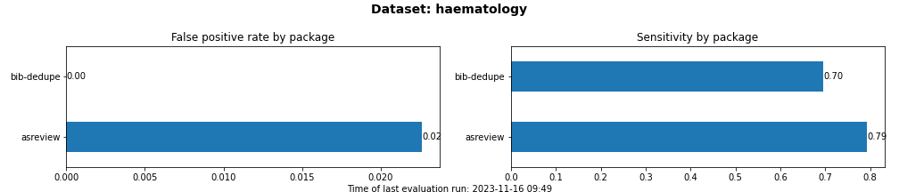
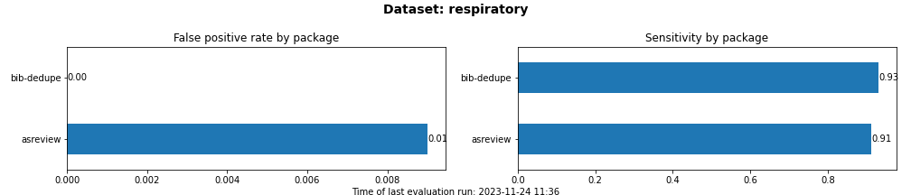
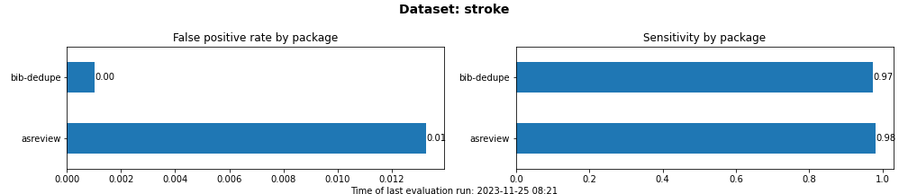

# bib-dedupe

<!-- [](https://github.com/CoLRev-Environment/bib-dedupe/releases/) -->
[](https://github.com/pre-commit/pre-commit)

## Overview

Bib-Dedupe is an open-source **Python library for deduplication of bibliographic records**, tailored for literature reviews.
Unlike traditional deduplication methods, Bib-Dedupe focuses on entity resolution, linking duplicate records instead of simply deleting them.
This approach enables validation, undo operations, and a more nuanced understanding of record relationships.

## Features

- **Entity Resolution**: Bib-Dedupe goes beyond traditional deduplication by performing entity resolution, linking duplicate records instead of deleting them. This allows for validation, undo operations, and a more comprehensive understanding of record relationships.
- **Programmatic Access**: Bib-Dedupe is designed for seamless integration into your research workflow, providing programmatic access for easy incorporation into scripts and applications.
- **Transparent and Reproducible Rules**: Bib-Dedupe's blocking and matching rules are transparent and easily reproducible. Researchers can fine-tune these rules based on their specific needs, promoting reproducibility in deduplication processes.
- **Continuous Benchmarking**: Continuous integration tests running on GitHub Actions ensure ongoing benchmarking, maintaining the library's reliability and performance across datasets.

## Installation

To install Bib-Dedupe, use the following pip command:

```bash
pip install bib-dedupe
```

## Getting Started

```python
import pandas as pd
import bib_dedupe

# Load your bibliographic dataset into a pandas DataFrame
records_df = pd.read_csv("records.csv")

# Initialize Bib-Dedupe
deduper = bib_dedupe.BibDeduper()

# Block records
blocked_df = deduper.block_pairs_for_deduplication(
    records_df=records_df
)
# Identify matches
matches = deduper.identify_true_matches(blocked_df)

# Review and handle identified duplicates as needed
```

For more detailed usage instructions and customization options, refer to the documentation.

## Continuous evaluation

Bib-dedupe is continuously evaluated against libraries for duplicate removal in bibliographic datasets.
The notebooks are available for

- [bib-dedupe](notebooks/bib-dedupe.ipynb)
- [asreview](notebooks/asreview.ipynb)

A summary of the evaluation is available in the [README.md](notebooks/README.md), detailed results are exported to a [csv file](output/evaluation.csv) and plotted based on this [notebook](notebooks/comparison.ipynb):









## Documentation

Explore the official documentation for comprehensive information on installation, usage, and customization of Bib-Dedupe.

## Citation

If you use Bib-Dedupe in your research, please cite it as follows:

TODO

## Contribution Guidelines

We welcome contributions from the community to enhance and expand Bib-Dedupe. If you would like to contribute, please follow our contribution guidelines.

## License

Bib-Dedupe is released under the MIT License, allowing free and open use and modification.

## Contact

For any questions, issues, or feedback, please open an issue on our GitHub repository.

Happy deduplicating with Bib-Dedupe!
