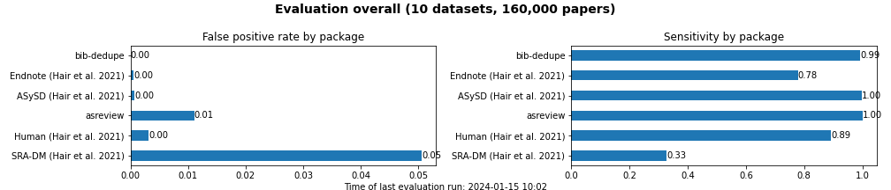

Evaluation
====================================

We run a continuous evaluation of tools for duplicate removal in bibliographic datasets.
The `evaluation script <https://github.com/CoLRev-Environment/bib-dedupe/tree/main/notebooks/evaluation.py>`_ is executed by a `GitHub workflow <https://github.com/CoLRev-Environment/bib-dedupe/actions/workflows/evaluate.yml>`_ on a weekly basis.
Detailed results are exported to a `csv file <https://github.com/CoLRev-Environment/bib-dedupe/tree/main/output/evaluation.csv>`_, and aggregated summaries are exported to `current_results.md <https://github.com/CoLRev-Environment/bib-dedupe/tree/main/output/current_results.md>`_.

Tools are ranked according to false-positive rate. The lower the false-positive rate, the better the tool.

.. list-table::
   :header-rows: 1
   :widths: 8 25 22 35

   * - Rank
     - Tool
     - Type
     - Comment
   * - 1
     - `BibDedupe <https://github.com/CoLRev-Environment/bib-dedupe>`_
     - Python library
     - 
      * 🏅 State-of-the-art (Python)
   * - 2
     - `ASySD <https://github.com/camaradesuk/ASySD>`_
     - R package
     - 
      * 🏅 State-of-the-art (R)
   * - 4
     - `ASReview Data Dedup <https://github.com/asreview/asreview-datatools>`_
     - Python library
     - 
      * ☢️ High FP error rate
   * - 3
     - `Buhos <https://github.com/clbustos/buhos>`_
     - Web-based (Ruby)
     - 
      * ☢️ High FP error rate
      * ❓ Evaluation incomplete
      * ⌛ Long runtime
   * - NA
     - `dedupe.io <https://github.com/dedupeio/dedupe>`_ / `pandas-dedupe <https://github.com/Lyonk71/pandas-dedupe>`_
     - Python library
     - 
      * 😩 Requires manual training
      * ❓ Performance not reproducible
   * - NA
     - `deduklick <https://systematicreviewsjournal.biomedcentral.com/articles/10.1186/s13643-022-02045-9>`_
     - Proprietary software
     - 
      * ❓ Performance unknown
      * 🚫 No programmatic access
      * 🔒 Proprietary code
   * - NA
     - `SRA-Dedupe <https://github.com/IEBH/sra-dedupe-ui>`_
     - Proprietary software
     - 
      * ❓ Performance unknown
      * 🚫 No programmatic access
   * - NA
     - Endnote
     - Proprietary software (local)
     - 
      * 😩 Requires manual review
      * ❓ Performance unknown
      * 🚫 No programmatic access
      * 🔒 Proprietary code
   * - NA
     - Covidence
     - Proprietary software (web-based)
     - 
      * ❓ Performance unknown
      * 🚫 No programmatic access
      * 🔒 Proprietary code

Datasets
-------------------

.. list-table::
   :header-rows: 1
   :widths: 20 20 20 40

   * - Dataset
     - Reference
     - Size (n)
     - Status
   * - `cytology_screening <https://github.com/CoLRev-Environment/bib-dedupe/tree/main/data/cytology_screening>`_
     - [4]
     - 1,856
     - Included (based on `OSF <https://osf.io/dyvnj/>`_)
   * - `haematology <https://github.com/CoLRev-Environment/bib-dedupe/tree/main/data/haematology>`_
     - [4]
     - 1,415
     - Included (based on `OSF <https://osf.io/dyvnj/>`_)
   * - `respiratory <https://github.com/CoLRev-Environment/bib-dedupe/tree/main/data/respiratory>`_
     - [4]
     - 1,988
     - Included (based on `OSF <https://osf.io/dyvnj/>`_)
   * - `stroke <https://github.com/CoLRev-Environment/bib-dedupe/tree/main/data/stroke>`_
     - [4]
     - 1,292
     - Included (based on `OSF <https://osf.io/dyvnj/>`_)
   * - `cardiac <https://github.com/CoLRev-Environment/bib-dedupe/tree/main/data/cardiac>`_
     - [2]
     - 8,948
     - Included (based on `OSF <https://osf.io/c9evs/>`_)
   * - `depression <https://github.com/CoLRev-Environment/bib-dedupe/tree/main/data/depression>`_
     - [2]
     - 79,880
     - Included (based on `OSF <https://osf.io/c9evs/>`_)
   * - `diabetes <https://github.com/CoLRev-Environment/bib-dedupe/tree/main/data/diabetes>`_
     - [2]
     - 1,845
     - Included (based on `OSF <https://osf.io/c9evs/>`_)
   * - `neuroimaging <https://github.com/CoLRev-Environment/bib-dedupe/tree/main/data/neuroimaging>`_
     - [2]
     - 3,438
     - Included (based on `OSF <https://osf.io/c9evs/>`_)
   * - `srsr <https://github.com/CoLRev-Environment/bib-dedupe/tree/main/data/srsr>`_
     - [2]
     - 53,001
     - Included (based on `OSF <https://osf.io/c9evs/>`_)
   * - `digital_work <https://github.com/CoLRev-Environment/bib-dedupe/tree/main/data/digital_work>`_
     - [5]
     - 7,159
     - Included
   * - TBD
     - [1]
     - NA
     - Requested: 2023-11-14
   * - TBD
     - [3]
     - NA
     - Requested: 2023-11-14

.. note::
   The `SYNERGY <https://github.com/asreview/synergy-dataset>`_ datasets are not useful to evaluate duplicate identification algorithms because they only contain IDs, and the associated metadata would have no variance.

Duplicate definition
----------------------------------

Duplicates are defined as potentially differing bibliographic representations of the same real-world record (Rathbone et al. 2015,[4]).
This conceptual definition is operationalized as follows.
The following are considered **duplicates**:

- Papers referring to the same record (per definition)
- Paper versions, including the author's original, submitted, accepted, proof, and corrected versions
- Papers that are continuously updated (e.g., versions of Cochrane reviews)
- Papers with different DOIs if they refer to the same record (e.g., redundantly registered DOIs for online and print versions)

The following are considered **non-duplicates**:

- Papers reporting on the same study if they are published separately (e.g., involving different stages of the study such as pilots and protocols, or differences in outcomes, interventions, or populations)
- A conference paper and its extended journal publication
- A journal paper and a reprint in another journal

It is noted that the focus is on duplicates of bibliographic *records*.
The linking of multiple records reporting results from the *same study* is typically done in a separate step after full-text retrieval, using information from the full-text document, querying dedicated registers, and potentially corresponding with the authors [see Higgins et al. sections 4.6.2 and 4.6.2].

The datasets may have applied a different understanding of duplicates. We double-checked borderline cases to make sure that the duplicate pairs in the data correspond to our definition.

- Rathbone et al. (2015) [4]: "A duplicate record was defined as being the same bibliographic record (irrespective of how the citation details were reported, e.g. variations in page numbers, author details, accents used or abridged titles). Where further reports from a single study were published, these were not classed as duplicates as they are multiple reports which can appear across or within journals. Similarly, where the same study was reported in both journal and conference proceedings, these were treated as separate bibliographic records."

- Borissov et al. (2022) [1]: "Following a standardized definition [6, 7, 9], we defined one or more duplicates as an existing unique record having the same title, authors, journal, DOI, year, issue, volume, and page number range metadata."

Evaluation: Dataset model and confusion matrix
---------------------------------------------------

Record list before de-duplication

.. list-table::
   :header-rows: 1
   :widths: 10 30 60

   * - ID
     - Author
     - Title
   * - 1
     - John Doe
     - Introduction to Data Science
   * - 2
     - J. Smith
     - the art of problem solving
   * - 3
     - Jane A. Smith
     - The Art of Problem Solving
   * - 4
     - Jane M. Smith
     - the art of problem solving
   * - 5
     - Alex Johnson
     - beyond the basics: advanced programming

Duplicate matrix:

.. csv-table::
   :header: "", "1", "2", "3", "4", "5"
   :widths: 5, 5, 5, 5, 5, 5

   "1", "-", "-", "-", "-", "-"
   "2", "", "-", "-", "-", "-"
   "3", "", "X", "-", "-", "-"
   "4", "", "X", "X", "-", "-"
   "5", "", "", "", "", "-"

Components:

.. list-table::
   :header-rows: 1
   :widths: 10 30

   * - ID
     - Component
   * - 1
     - c_1
   * - 2
     - c_2
   * - 3
     - c_2
   * - 4
     - c_2
   * - 5
     - c_3

Record list without duplicates:

.. list-table::
   :header-rows: 1
   :widths: 10 30 60

   * - ID
     - Author
     - Title
   * - 1
     - John Doe
     - Introduction to Data Science
   * - 2
     - J. Smith
     - the art of problem solving
   * - 5
     - Alex Johnson
     - beyond the basics: advanced programming

Note: Instead of paper 2, papers 3 or 4 could have been retained. It is not pre-determined which duplicates are retained or removed.
That makes the evaluation challenging because the following list would also be correct:

.. list-table::
   :header-rows: 1
   :widths: 10 30 60

   * - ID
     - Author
     - Title
   * - 1
     - John Doe
     - Introduction to Data Science
   * - 4
     - Jane M. Smith
     - the art of problem solving
   * - 5
     - Alex Johnson
     - beyond the basics: advanced programming

We use the `compare_dedupe_id()` method of `bib_dedupe.dedupe_benchmark`, which compares sets.

Given the set of duplicate IDs `did = [2,3,4]` as the ground truth, it is evident that only one of the IDs should be retained in the merged list `ml` (although any selection among the IDs in `did` would be valid).

- If none of the duplicate IDs is retained, there is one false positive (FP), i.e., a record that was erroneously removed as a duplicate. The remaining (`len(did)-1`) records are counted as true positives (TP).
- The first duplicate ID that is retained is counted as the true negative (TN), i.e., the record correctly marked as a non-duplicate. Additional records in `ml` are marked as false negatives (FN) because they should have been removed. Remaining records from `did` that are not in `ml` are marked as true positives (TP) because they were correctly removed from `ml`.

References
----------

.. [1] Borissov, N., Haas, Q., Minder, B., Kopp-Heim, D., von Gernler, M., Janka, H., ... & Amini, P. (2022). Reducing systematic review burden using Deduklick: a novel, automated, reliable, and explainable deduplication algorithm to foster medical research. Systematic Reviews, 11(1), 172. doi:10.1186/s13643-022-02045-9

.. [2] Hair, K., Bahor, Z., Macleod, M., Liao, J., & Sena, E. S. (2023). The Automated Systematic Search Deduplicator (ASySD): a rapid, open-source, interoperable tool to remove duplicate citations in biomedical systematic reviews. BMC Biology, 21(1), 189.

.. [3] Kwon, Y., Lemieux, M., McTavish, J., & Wathen, N. (2015). Identifying and removing duplicate records from systematic review searches. Journal of the Medical Library Association, 103(4), 184. doi:10.3163/1536-5050.103.4.004

.. [4] Rathbone, J., Carter, M., Hoffmann, T., & Glasziou, P. (2015). Better duplicate detection for systematic reviewers: evaluation of Systematic Review Assistant-Deduplication Module. Systematic Reviews, 4, 1-6. doi:10.1186/2046-4053-4-6

.. [5] Wagner, G., Prester, J., & Paré, G. (2021). Exploring the boundaries and processes of digital platforms for knowledge work: A review of information systems research. The Journal of Strategic Information Systems, 30(4), 101694.
